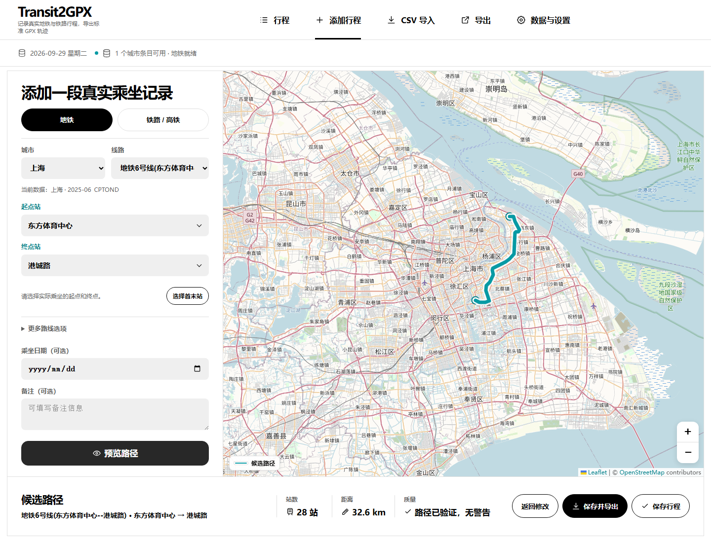
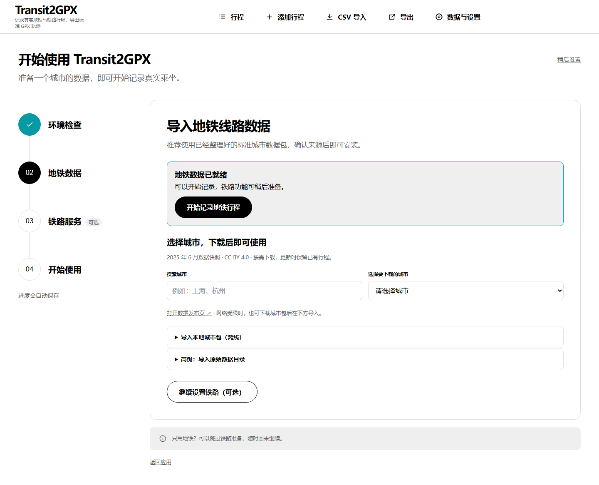
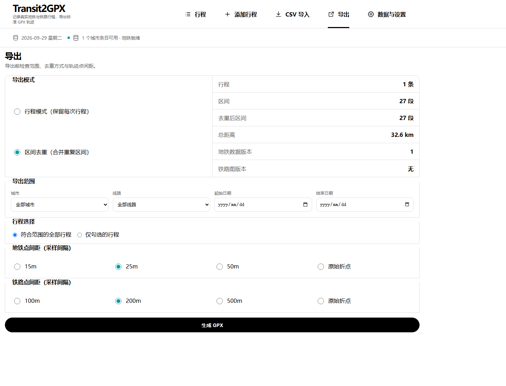

# Transit2GPX

选择实际乘坐的起终点，预览并确认线路，导出 GPX。在世界迷雾等支持 GPX 的应用中，补上旅途中没能记录的轨迹。

 

**[开始使用](docs/GETTING_STARTED.md) · [查看演示](#从选站到导出) · [支持范围](#开始前你需要知道) · [发行包状态](docs/PACKAGING.md)**

Windows 10/11 x64 · macOS · 行程本地存储 · 标准 GPX 导出

原名 Transit2Fog（更早为 Metro2Fog）。升级兼容与命名说明见[改名迁移说明](docs/RENAMING.md)。

[下载 Transit2GPX v1.0.1 正式版](https://github.com/Uddoo/Transit2GPX/releases/tag/v1.0.1)。旧版 Transit2Fog 的数据与配置继续兼容。

*Transit2GPX 当前界面实拍 · 上海地铁 6 号线 · 28 站 / 32.6 km。数据来源与拍摄说明见[素材说明](docs/MEDIA.md)。*

首次打开会进入[首次使用向导](docs/ONBOARDING.md)，逐步检查环境、导入地铁数据并按需启动铁路服务；已有用户可从“数据与设置”重新进入。

## 从选站到导出

**选好起终点 → 确认候选线路 → 保存并导出 GPX。**

<strong>播放 20 秒操作演示</strong>（改名前版本，动图可折叠）

[观看 MP4 版本](docs/images/metro-demo.mp4) · [素材与数据说明](docs/MEDIA.md)

演示只展示环境与数据准备完成后的操作；不包含首次下载、导入和依赖安装时间。

- **补上实际坐过的区间。** 支持中国地铁与国铁行程；按起终点生成候选，不把整条线路算作你的足迹。
- **每条路线由你确认。** 环线、支线与多条铁路候选都可预览，有歧义时明确提示。
- **把轨迹带到自己的应用。** 输出标准 GPX 1.1；可用于世界迷雾等支持 GPX 轨迹导入的应用。

### 从一个城市开始准备数据

首次使用向导集中展示环境检查、城市数据准备和可选的铁路服务配置。已有地铁数据就绪后，可以直接开始记录。

铁路仍支持多条候选路线的预览与确认；[北京南—上海虹桥历史验收截图](docs/images/railway-candidates.jpg)保留供参考，该图展示改名前版本。

<strong>查看 GPX 导出设置</strong>：逐次行程与去重覆盖两种方式

保存每次乘坐记录可选 journey；汇总同一数据版本下走过的区间可选 coverage。地铁与铁路可分别设置采样间距。

## 开始使用

**第一次建议先完成一条地铁行程。** 环境与数据准备好后，只需选站、预览、确认并导出；铁路可在之后按需配置。

| 你想做什么 | 从这里开始 |
|---|---|
| 第一次运行，导出一条地铁轨迹 | [首次使用指南](docs/GETTING_STARTED.md) |
| 配置铁路行程与本地图 | [铁路准备步骤](docs/GETTING_STARTED.md#铁路最短可用路径) |
| 使用或构建桌面安装包 | [安装包说明与当前分发状态](docs/PACKAGING.md) |
| 排查环境、数据或启动问题 | [Windows 指南](docs/WINDOWS.md) · [开发与运行](docs/DEVELOPMENT.md) |

> **获取方式：** [v1.0.1 正式版](https://github.com/Uddoo/Transit2GPX/releases/tag/v1.0.1)提供 **Windows x64 Setup.exe / ZIP** 和 **macOS Apple Silicon PKG / TAR.GZ**，附 SHA-256 校验文件。安装包自带 Python 运行库与前端，无需安装 Node.js、npm 或 uv。当前产物未签名、公证；安装方式和验证范围见[安装包说明](docs/PACKAGING.md)。
>
> **数据准备：** 第三方地铁数据需自行下载；当前 Figshare v2 包存在字段兼容问题，已在[数据获取步骤](docs/GETTING_STARTED.md#2-获取一份地铁数据)说明。依赖与数据下载时间取决于网络，不承诺开箱即用。

## 开始前你需要知道

| 能力 | 当前支持 | 准备条件与边界 |
|---|---|---|
| 地铁行程 | 地图选站、手动录入、CSV 导入与审核 | 需先导入兼容地铁数据；已验收的 46 城属于特定数据快照，不代表实时线路更新 |
| 铁路行程 | 手动/CSV 录入、候选比较、确认与保存 | 需另备 Java 17+ 和已验证的铁路图；不内置 12306 抓取 |
| GPX 导出 | 地铁与铁路混合导出；journey / coverage | WGS‑84、GPX 1.1 轨迹；不同目标应用的导入规则可能不同 |
| 本地运行 | Windows 10/11 x64、macOS | 源码运行需 Node.js 22+、npm 10+、uv 0.9+；Windows 另需 PowerShell 7 |
| 隐私 | 乘车历史与导入文件在本机处理和保存 | 默认底图会请求 OpenStreetMap 在线瓦片，可关闭或配置合规的自托管服务 |

平台验证证据见[带日期的验证记录](docs/PLATFORM_VALIDATION.md)，其余边界见[已知限制](docs/KNOWN_LIMITATIONS.md)。

## 常见问题

**没有实时 GPS 记录，也可以使用吗？**

可以根据自己实际乘坐的起终点补录行程，再检查候选轨迹。它不会替你证明乘坐事实，也不会自动知道列车当日实际走过的线路。

**只能用于世界迷雾吗？**

输出使用标准 GPX 1.1 的 `<trk>` / `<trkseg>` 结构。世界迷雾是已有人工验收记录的兼容示例，其他应用请先用少量行程抽检。

**安装后会自带全国数据吗？**

不会。地铁数据需自行导入；铁路 PBF 与 graph 也需单独准备。安装程序与数据准备是两个步骤。

**可以完全离线使用吗？**

行程处理在本机进行；默认在线底图需要联网。关闭底图后可使用已准备好的本地数据进行相关操作，数据与依赖的首次获取仍需准备。

## 设计与信任

预览、保存和导出使用同一组不可变线路片段，避免结果漂移。原始数据保留版本、校验和、许可与质量记录；有阻断问题的线路不能导出。

代码采用 [Apache License 2.0](LICENSE)。第三方地理数据分别遵循其自身许可，详见[数据与第三方署名](ATTRIBUTION.md)。

## 深入了解与参与

- [首次使用指南](docs/GETTING_STARTED.md)：环境、数据与地铁/铁路操作。
- [平台验证记录](docs/PLATFORM_VALIDATION.md)：历史验证基线与本次构建证据。
- [展示素材说明](docs/MEDIA.md)：真实截图、演示与分享封面的来源。
- [产品需求](docs/PRODUCT.md)：目标用户、完整流程、功能与验收要求。
- [系统架构](docs/ARCHITECTURE.md)：技术栈、模块边界、运行与数据流。
- [数据与 API 契约](docs/DATA_API.md)：数据库模型、CSV、REST、GPX 和几何约束。
- [国铁轨迹扩展设计](docs/RAILWAY.md)：铁路数据源、Provider、模型、候选、API、GPX 与实施顺序。
- [关键设计决策](docs/DECISIONS.md)：已确定方案、理由与代价。
- [视觉与交互设计系统](docs/DESIGN_SYSTEM.md)：概念图、tokens、组件和响应式规则。
- [开发与运行](docs/DEVELOPMENT.md)：安装、开发、生产启动和质量检查。
- [Windows 原生运行](docs/WINDOWS.md)：PowerShell 7 命令、路径写法、铁路环境与故障排查。
- [安装包与一体化铁路运行](docs/PACKAGING.md)：独立安装产物、打包 smoke test、sidecar 监督与数据边界。
- [交付路线图](docs/ROADMAP.md)：当前进度、实施阶段、测试矩阵与完成标准。
- [已知限制](docs/KNOWN_LIMITATIONS.md)：当前验收缺口和发布前待办。
- [v1.0 验收审计](docs/V1_AUDIT.md)：逐条完成状态、测试证据与最后外部阻断项。
- [Fog of World 实机验收](docs/FOG_ACCEPTANCE.md)：两份真实数据 GPX 的安全导入步骤、通过标准与结果记录模板。
- [Fog of World 铁路实机验收](docs/RAIL_FOG_ACCEPTANCE.md)：北京南—上海虹桥全国铁路 GPX 的固定哈希、抽查步骤与关闭条件。
- [Apache License 2.0](LICENSE)：Transit2GPX 项目代码许可证。
- [数据与第三方署名](ATTRIBUTION.md)：CPTOND、Science Data Bank、OpenStreetMap、Geofabrik 与 OpenRailRouting 的署名边界。

数据源、标准与参考资料

## 数据与标准基线

- CPTOND-2025：以 2025 年 6 月数据快照为首个数据源；Figshare v2 标注 CC BY 4.0，并描述覆盖 46 个城市的地铁系统。
- Science Data Bank 时序数据集：基于 CPTOND-2025 的 46 城地铁数据，补充 1971–2025 开通时序；页面标注 CC BY-NC-SA 4.0，作为 Figshare 受限时的兼容来源。
- 国铁几何：Geofabrik 提供的 OpenStreetMap 中国或省级 PBF，按 ODbL 1.0 使用并保留 `© OpenStreetMap contributors` 署名。
- 铁路路径引擎：固定提交的 OpenRailRouting/GraphHopper fork；运行时图版本、自定义中国国铁 Profile 和 PBF checksum 共同构成身份。
- GPX：导出遵循 Topografix GPX 1.1，坐标基准为 WGS‑84。
- GPX 兼容性：目标应用需要支持 GPX 1.1 的 `<trk>` / `<trkseg>` 轨迹；点数限制、简化规则和重复轨迹处理以各应用为准。
- Fog of World：兼容应用示例；官网说明支持导入 GPX/KML 轨迹。

原始 CPTOND 数据不直接提交到仓库。应用应提供可复现的导入流程，并在界面和导出元数据中保留数据署名。

## 参考资料

- [CPTOND-2025 数据集](https://figshare.com/articles/dataset/CPTOND-2025/29377427)
- [CPTOND 项目](https://github.com/jean89091515/CPTOND)
- [CPTOND-2025 论文](https://doi.org/10.1038/s41597-025-06505-4)
- [中国城市地铁修建时序数据集（1971–2025）](https://doi.org/10.57760/sciencedb.33335)
- [OpenRailRouting](https://github.com/geofabrik/OpenRailRouting)
- [Geofabrik 中国 OSM 下载](https://download.geofabrik.de/asia/china.html)
- [OpenStreetMap copyright 与 ODbL](https://www.openstreetmap.org/copyright)
- [GPX 1.1 Schema](https://www.topografix.com/gpx/1/1/)
- [兼容应用示例：Fog of World](https://fogofworld.app/)

